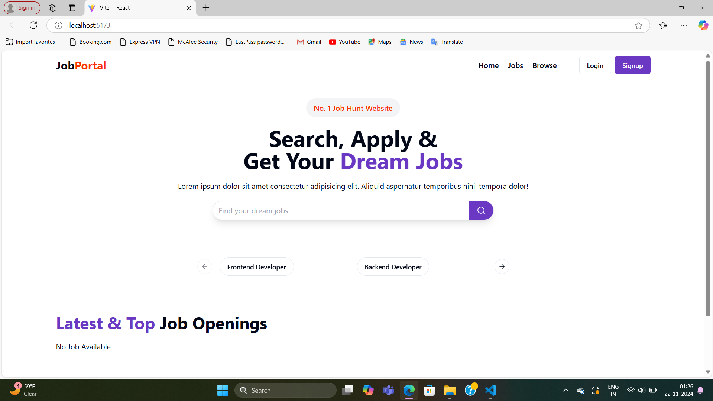
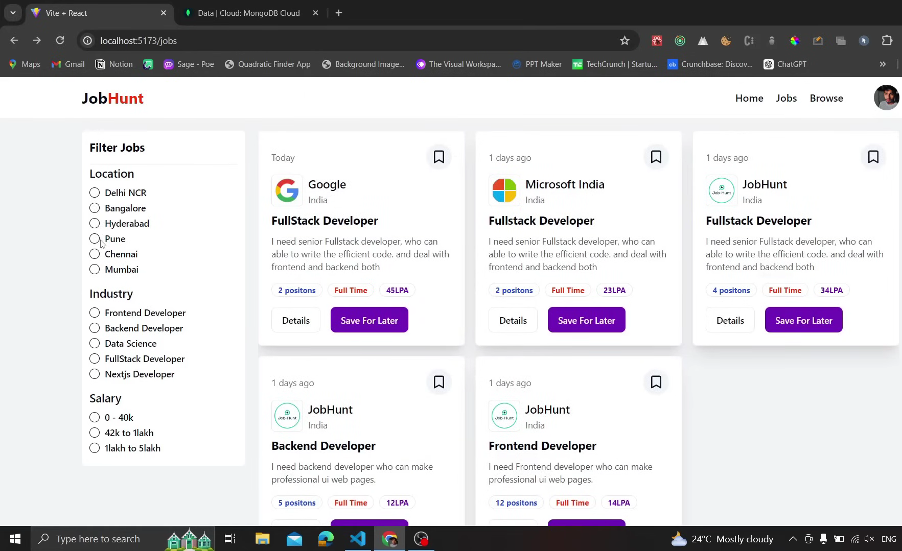

# Job Portal Web Application

A full-stack job portal application where users can search for jobs, view job details, manage profiles, and recruiters can add, accept, or reject job applications.

## Features

1. **Home Page**  
   - Search for jobs based on roles.

2. **Job Listings**  
   - View a list of available jobs after clicking a search option.

3. **Job Details**  
   - Detailed information about a selected job.

4. **User Authentication**  
   - Sign-in for registered users.  
   - Registration for new users.

5. **Admin/Recruiter Panel**  
   - Admin can add new jobs.  
   - Manage job applications with accept/reject functionality.

6. **User Profile**  
   - Displays user information and job application status.

---

## Screenshots

### 1. Home Page  


### 2. Job Section  


### 3. Job Details  


### 4. Sign In / Register  
  


### 5. Admin Panel  
  


### 6. User Profile  


---

## Tech Stack

### Frontend
- ReactJS
- CSS3 / Tailwind / Bootstrap (choose based on your design)
- Axios for API calls

### Backend
- Express.js
- Node.js

### Database
- MongoDB

---

## Installation & Setup

1. Clone the repository:
   ```bash
   git clone https://github.com/yourusername/job-portal.git
   cd job-portal
